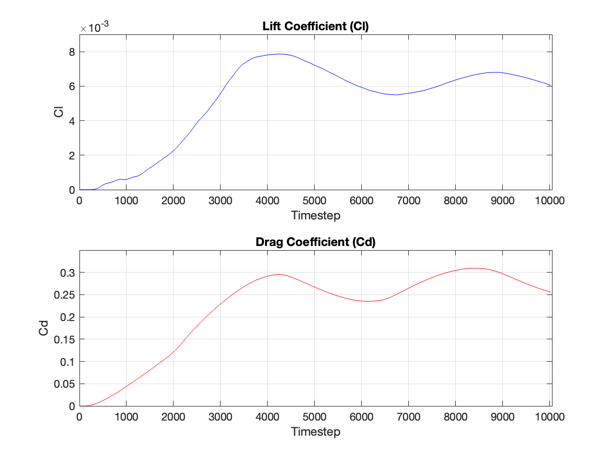
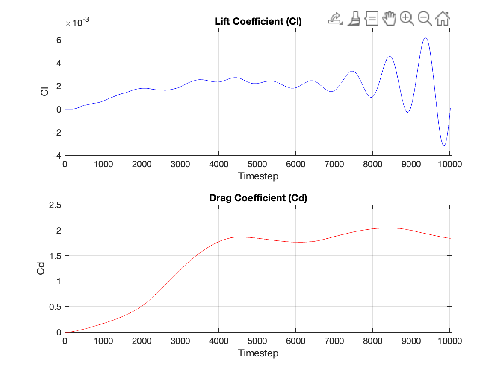

# Project Group 11: Lattice Boltzmann Method

## Introduction and Objectives

This project implements the Lattice Boltzmann Method (LBM) to simulate fluid flows in both 2D and 3D, using the D2Q9 and D3Q19 models. It includes a 2D lid-driven cavity problem, a 3D lid-driven cavity simulation, a 2D wind tunnel configuration with obstacles insertion and a 2D CUDA-parallelized implementation for GPU acceleration.


<br>

---

## Requirements

- `g++` with C++17 or higher
- OpenMP development package
- Python (for 2D post-processing)
- ParaView (for 3D visualization)

---

## Compilation and Execution

### 1. Make the launcher script executable

Before running the simulation, ensure that the launcher script has execution permissions:

```bash
chmod +x run.sh
```

### 2. Run the simulation

Once the script is executable, run the simulation by passing the required arguments:

```bash
./run.sh [FLAGS]
```

---

### Solver Selection

| Flag      | Description                      |
|-----------|----------------------------------|
| `--2dLbm` | Run the 2D solver                |
| `--3dLbm` | Run the 3D solver                |
| `--cuda`  | Run the 2D CUDA-based GPU solver |

### Available Flags

| Flag                            | Behavior                                               | 3D LBM | 2D LBM | OBLIGATORY|
|---------------------------------|--------------------------------------------------------|:------:|:------:|:---------------|
| `-m`, `--mesh`                  | Define the grid resolution in X for 2D and for all direction in 3D.    | ✅     | ✅     | ✅|
| `-s`, `--steps`                 | Set total number of simulation time steps.             | ✅     | ✅     |✅|
| `-r`, `--re`, `--reynolds`      | Assign the Reynolds number for flow conditions.        | ✅     | ✅     |✅|
| `-u`                            | Initial or boundary fluid velocity (default: 0.1).     | ✅     | ✅     |⛔|    
| `-omp`, `--Openmp`              | Activate OpenMP.                                       | ✅     | ✅     |⛔|    
| `-h`, `--help`                  | Display usage information and exit.                    | ✅     | ✅     |⛔|    
| `-tunnel`                       | Apply wind-tunnel boundary geometry.                   | ⛔     | ✅     |⛔|   
| `-my`                           | Specify grid resolution in Y only for 2D(equal to X default).      | ⛔     | ✅     |⛔| 


---

### Examples

   * **3D solver** with a cubic mesh of 100 points, 1,000 time steps, Reynolds number = 500:

     ```bash
     ./run.sh --3dLbm -m 100 -s 1000 -r 500
     ```

   * **2D solver** with OpenMP, wind-tunnel geometry, mesh 200×100, 2,000 steps, Re = 1000:

     ```bash
     ./run.sh --2dLbm -m 200 -my 100 -s 2000 -r 1000 -omp -tunnel
     ```

   * **CUDA solver** on GPU architecture SM 7.5, mesh 256, 1,500 steps, Re = 750:

     ```bash
     ./run.sh --cuda -m 256 -s 1500 -r 750
     ```

---

## Running CUDA with Colab

To run the CUDA version without a local NVIDIA GPU, you can use Google Colab.  
A ready-to-use Python notebook with detailed instructions is available [here](src/cuda/lbm_cuda.ipynb).


---

## 2D Visualization

To visualize the results of the 2D simulation, either lid-driven cavity or tunnel-type problem, move in the 2DLBM folder with:

```bash
     cd src && cd 2DLBM
```

Once in the correct folder, run the python script:

```bash
     python visualizer.py
```

In case the visualizer does not work, you might have some libraries conflicts. In that case run the visualizer in a virtual environment. You can create it with:

```bash
/u/sw/toolchains/gcc-glibc/11.2.0/base/bin/python -m venv ~/newenv &&
source ~/newenv/bin/activate
```
The output video is saved in the 'output' directory.

---

## Validation


To verify the correctness of our implementation, we compared our simulation results for the lid-driven cavity problem against benchmark reference data for Reynolds numbers **100**, **400**, and **1000**.

The comparison focuses on the **vertical centerline velocity profile**: specifically, the **y-component of the velocity (`v_y`)** along the line `x = L/2` from the bottom to the top of the cavity (`y = 0` to `y = 1`).

Each plot below shows:
- **Our simulation results** (dashed line with markers)
- **Reference values** from the literature (solid line)


<div style="display: flex; gap: 20px;">
  
  
  
</div>

### Observations

The simulation results for Re = 100 closely match the reference data, indicating good agreement. As the Reynolds number increases to 400 and 1000, deviations become more evident, particularly near the lower part of the cavity. This gradual build-up of error is likely due to slight differences in implementation details or parameter formulations. Nonetheless, the simulation shows consistent accuracy and stable behavior across a range of Reynolds numbers, supporting the validity of the overall approach.


---

### Gallery


<table>
    <tr>
        <th>Re=100 on a 250x250 cavity</th>
        <th>Re=10000 on a 250x250 cavity</th>
    </tr>
    <tr>
        <td></td>
        <td></td>
    </tr>
</table>

<table>
    <tr>
        <th>airfoil</th>
        <th>cl cd</th>
    </tr>
    <tr>
        <td></td>
        <td></td>
    </tr>
</table>


<table>
    <tr>
        <th>circle</th>
        <th>cl cd</th>
    </tr>
    <tr>
        <td></td>
        <td></td>
    </tr>
</table>


---

## 3D Lid-Driven Cavity Simulation with 3DLBM

### Simulation Strategy

* **Domain discretization:** The cavity is divided into cubic grid cells, each representing local fluid populations.
* **Time-stepping cycle:**

  1. **Collision:** Particle distributions relax toward local equilibrium, modeling viscous dissipation.
  2. **Streaming:** Updated distributions move along discrete velocity directions to neighboring cells.
  3. **Boundary conditions:**

     * **Stationary walls:** Halfway bounce-back enforces no-slip zero-velocity at solid faces.
     * **Moving lid:** Zou–He velocity boundary condition prescribes a uniform tangential speed on the top plane, delivering accurate momentum transfer.
* **Stabilization:** A two-relaxation-time collision operator separates symmetric and anti-symmetric moments, damping spurious modes at moderate Reynolds numbers.
* **Parallelization:** Shared-memory threading accelerates both collision and streaming operations, scaling efficiently on multicore processors.

### Output and Post-Processing

Simulation data are exported in VTK format and visualized using ParaView:

* Bulk import of VTK sequences for time-resolved analysis.
* Stream Tracer and Glyph filters to highlight vortex structures.
* Automated rendering of video animations via ParaView’s Python scripting interface.

<details>
 <summary> Gallery of videos (click to expand) </summary>

### evolutions of system with the streamline section evolutions
 
<table>
 <tr>
<th colspan="2">Re=100 on 100×100×100</th>
</tr>
<tr>
<td colspan="2">

</td>
</tr>
 <tr>
<th colspan="2">Re=500 on 100×100×100</th>
</tr>
<tr>
<td colspan="2">

</td>
</tr>
<tr>
<th colspan="2">Re=1000 on 100×100×100</th>
</tr>
<tr>
<td colspan="2">

</td>
</tr>
</table>

### Tubolar streamlines produced from a sphere seed

<table>
    <tr>
        <th>Re=100 on a 100x100x100 cavity</th>
        <th>Re=500 on a 100x100x100 cavity</th>
        <th>Re=1000 on a 100x100x100 cavity</th>
    </tr>
    </tr>
    <tr>
        <td></td>
        <td></td>
         <td></td>
    </tr>
    
</table>

### isosurfaces and is sections

<table>
    <tr>
        <th>Re=100 on a 100x100x100 cavity</th>
        <th>Re=500 on a 100x100x100 cavity</th>
        <th>Re=1000 on a 100x100x100 cavity</th>
    </tr>
    </tr>
    <tr>
        <td></td>
        <td></td>
        <td></td>
    </tr>
    <tr>
        <td></td>
        <td></td>
        <td></td>
    </tr>
    
</table>

### Arrow representing vector of velocity

<table>
    <tr>
        <th>Re=100 on a 100x100x100 cavity</th>
        <th>Re=500 on a 100x100x100 cavity</th>
        <th>Re=1000 on a 100x100x100 cavity</th>
    </tr>
    </tr>
    <tr>
        <td></td>
        <td></td>
        <td></td>
    </tr>
 
</table>

### high reynolds exemple
<table>
    <tr>
        <th>Re=3000 on a 80x80x80 cavity</th>
   </tr>
    </tr>
    <tr>
        <td></td>
    </tr>
    <tr>
        <td></td>
    </tr>

    
</table>


</details>

## Authors

- Federico Pinto
- Mattia Gotti
- Michele Milani

